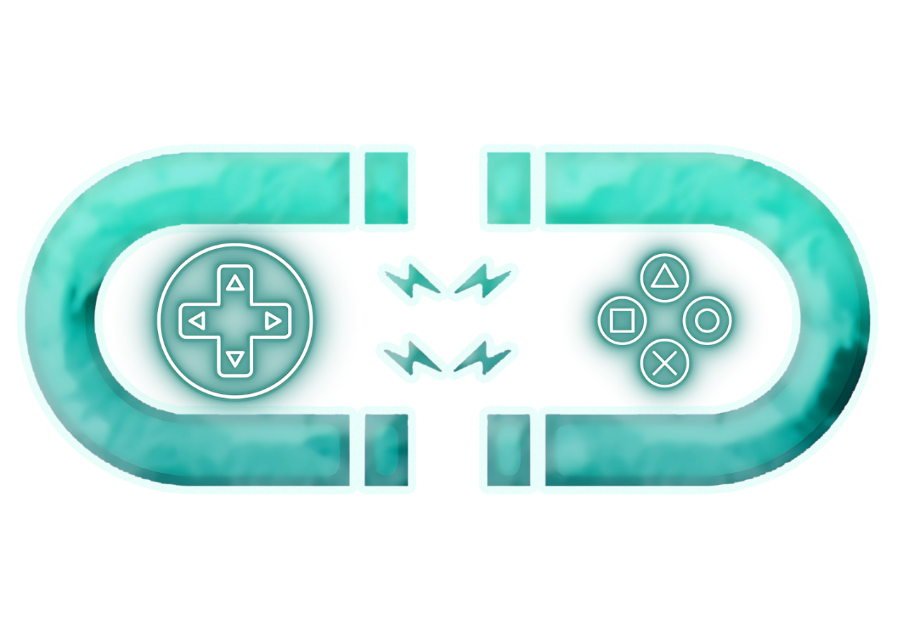

# 🧪 PHIGA - Physics Innovation & Global Achievement Platform

<div align="center">



**Empowering the next generation of physics enthusiasts through interactive competitions and learning**

[](https://reactjs.org/)
[](https://www.typescriptlang.org/)
[](https://vitejs.dev/)
[](https://tailwindcss.com/)
[](https://supabase.com/)

[🚀 Live Demo](#) • [📖 Documentation](#features) • [🤝 Contributing](#contributing) • [📧 Contact](#contact)

</div>

## 🌟 Overview

PHIGA (Physics Innovation & Global Achievement) is a modern, interactive platform designed to revolutionize physics education through engaging competitions, collaborative learning, and cutting-edge visualizations. Built with React, TypeScript, and modern web technologies, PHIGA provides an immersive experience for students, educators, and physics enthusiasts worldwide.

## ✨ Features

### 🎯 Core Features
- **🏆 Physics Competitions** - Interactive physics challenges and competitions
- **👨‍💼 Admin Dashboard** - Complete registration and participant management system
- **📧 Email Integration** - Automated email notifications and competition codes
- **🌐 Responsive Design** - Optimized for desktop, tablet, and mobile devices
- **🌙 Dark/Light Theme** - Toggle between themes for better user experience
- **🔒 Secure Authentication** - Protected admin areas with secure login

### 🎨 User Interface
- **Modern Design** - Clean, professional interface with Tailwind CSS
- **3D Visualizations** - Interactive physics simulations using Three.js
- **Smooth Animations** - GSAP-powered animations and transitions
- **Accessible** - WCAG compliant design principles
- **Fast Performance** - Optimized with Vite for lightning-fast development

### 📊 Management System
- **Registration System** - Streamlined participant registration process
- **Admin Panel** - Comprehensive dashboard for managing competitions
- **Code Generation** - Unique competition access codes for participants
- **Data Export** - CSV export functionality for registration data
- **Real-time Updates** - Live status updates and notifications

## 🛠️ Tech Stack

### Frontend
- **React 18** - Modern React with hooks and concurrent features
- **TypeScript** - Type-safe development with full IntelliSense
- **Vite** - Next-generation frontend tooling for fast development
- **Tailwind CSS** - Utility-first CSS framework for rapid styling

### Backend & Database
- **Supabase** - PostgreSQL database with real-time capabilities
- **EmailJS** - Client-side email service integration
- **Vercel/Netlify Ready** - Optimized for modern deployment platforms

### Libraries & Tools
- **Three.js** - 3D graphics and physics simulations
- **React Three Fiber** - React renderer for Three.js
- **GSAP** - Professional-grade animation library
- **React Icons** - Beautiful, customizable icon library
- **React Router** - Declarative routing for React applications

## 🚀 Quick Start

### Prerequisites
- **Node.js** (version 18.0 or higher)
- **npm** or **yarn** package manager
- **Git** for version control

### Installation

1. **Clone the repository**
   ```bash
   git clone https://github.com/geno543/Phiga-competition.git
   cd Phiga-competition
   ```

2. **Install dependencies**
   ```bash
   npm install
   # or
   yarn install
   ```

3. **Environment Setup**
   ```bash
   cp .env.local.example .env.local
   ```
   
   Edit `.env.local` with your configuration:
   ```env
   VITE_SUPABASE_URL=your_supabase_project_url
   VITE_SUPABASE_ANON_KEY=your_supabase_anon_key
   VITE_EMAILJS_SERVICE_ID=your_emailjs_service_id
   VITE_EMAILJS_TEMPLATE_ID=your_emailjs_template_id
   VITE_EMAILJS_PUBLIC_KEY=your_emailjs_public_key
   ```

4. **Database Setup**
   
   Follow the [Database Setup Guide](DATABASE_SETUP_GUIDE.md) to configure Supabase.

5. **Email Service Setup**
   
   Follow the [Email Setup Guide](EMAIL_SETUP_GUIDE.md) to configure EmailJS.

6. **Start Development Server**
   ```bash
   npm run dev
   # or
   yarn dev
   ```

7. **Open your browser**
   
   Navigate to `http://localhost:5173` to see the application.

## 📁 Project Structure

```
PHIGA/
├── public/                 # Static assets
│   ├── favicon.png
│   ├── phiga_logo.png
│   └── vite.svg
├── src/
│   ├── assets/            # Images, icons, and media
│   ├── components/        # Reusable React components
│   │   ├── AtomVisualization.tsx
│   │   ├── Features.tsx
│   │   ├── Footer.tsx
│   │   ├── Header.tsx
│   │   └── Hero.tsx
│   ├── contexts/          # React context providers
│   │   └── ThemeContext.tsx
│   ├── pages/            # Page components
│   │   ├── About.tsx
│   │   ├── Admin.tsx
│   │   ├── AdminLogin.tsx
│   │   ├── CompetitionAccess.tsx
│   │   ├── Contact.tsx
│   │   ├── FAQ.tsx
│   │   ├── Leaderboard.tsx
│   │   ├── ProtectedAdmin.tsx
│   │   ├── Registration.tsx
│   │   └── Rules.tsx
│   ├── utils/            # Utility functions
│   │   ├── codeGenerator.ts
│   │   ├── emailService.ts
│   │   └── supabase/
│   │       └── client.ts
│   ├── App.tsx           # Main app component
│   ├── main.tsx          # Application entry point
│   └── index.css         # Global styles
├── DATABASE_SETUP_GUIDE.md
├── EMAIL_SETUP_GUIDE.md
└── README.md
```

## 🔧 Configuration

### Database Configuration
The application uses Supabase as the backend database. Key tables include:
- **registrations** - Participant registration data
- **competitions** - Competition information
- **leaderboards** - Competition results and rankings

### Email Configuration
EmailJS is used for sending automated emails:
- Registration confirmations
- Competition access codes
- Administrative notifications

### Admin Access
- **Admin URL**: `/admin`
- **Default Password**: `genooo`
- **Features**: Registration management, code generation, data export

## 🎮 Usage

### For Participants
1. **Register** - Sign up for physics competitions
2. **Receive Code** - Get your unique competition access code via email
3. **Compete** - Access competitions using your code
4. **Track Progress** - View your performance on leaderboards

### For Administrators
1. **Login** - Access admin panel with credentials
2. **Manage** - Review and approve registrations
3. **Generate** - Create unique access codes for participants
4. **Monitor** - Track competition participation and results
5. **Export** - Download registration data for analysis

## 🚀 Deployment

### Build for Production
```bash
npm run build
# or
yarn build
```

### Deploy to Vercel
1. Connect your GitHub repository to Vercel
2. Set environment variables in Vercel dashboard
3. Deploy automatically on every push to main branch

### Deploy to Netlify
1. Connect your GitHub repository to Netlify
2. Set build command: `npm run build`
3. Set publish directory: `dist`
4. Configure environment variables

## 🤝 Contributing

We welcome contributions from the community! Here's how you can help:

### Development Setup
1. Fork the repository
2. Create a feature branch: `git checkout -b feature/amazing-feature`
3. Make your changes and test thoroughly
4. Commit your changes: `git commit -m 'Add amazing feature'`
5. Push to the branch: `git push origin feature/amazing-feature`
6. Open a Pull Request

### Code Style
- Use TypeScript for type safety
- Follow React best practices
- Write meaningful commit messages
- Add comments for complex logic
- Ensure responsive design

### Testing
```bash
npm run lint        # Run ESLint
npm run type-check  # Check TypeScript types
npm run build       # Test production build
```

## 📜 License

This project is licensed under the MIT License - see the [LICENSE](LICENSE) file for details.

## 🆘 Support

### Documentation
- [Database Setup Guide](DATABASE_SETUP_GUIDE.md)
- [Email Setup Guide](EMAIL_SETUP_GUIDE.md)
- [API Documentation](#)

### Get Help
- 📧 **Email**: hello@phiga.org
- 🌐 **Website**: [phiga.org](#)
- 💬 **Discord**: [Join our community](#)
- 🐛 **Issues**: [GitHub Issues](https://github.com/geno543/Phiga-competition/issues)

### Contact Information
- **Email**: hello@phiga.org
- **Phone**: +1 (555) 123-4567
- **Address**: Physics Education Center, Singapore

## 🎯 Roadmap

### Phase 1 (Current)
- ✅ Basic registration system
- ✅ Admin dashboard
- ✅ Email integration
- ✅ Responsive design

### Phase 2 (Next)
- 🔄 Advanced physics simulations
- 🔄 Real-time competitions
- 🔄 Mobile app development
- 🔄 AI-powered problem generation

### Phase 3 (Future)
- 🔄 Multi-language support
- 🔄 Advanced analytics
- 🔄 Social features
- 🔄 VR/AR integration

## 🙏 Acknowledgments

- **React Team** - For the amazing React framework
- **Supabase** - For the fantastic backend-as-a-service
- **Tailwind CSS** - For the utility-first CSS framework
- **Three.js** - For enabling beautiful 3D visualizations
- **Physics Community** - For inspiration and feedback

---

<div align="center">

**Built with ❤️ for the physics community**

[⭐ Star this repository](https://github.com/geno543/Phiga-competition) if you find it helpful!

</div>
